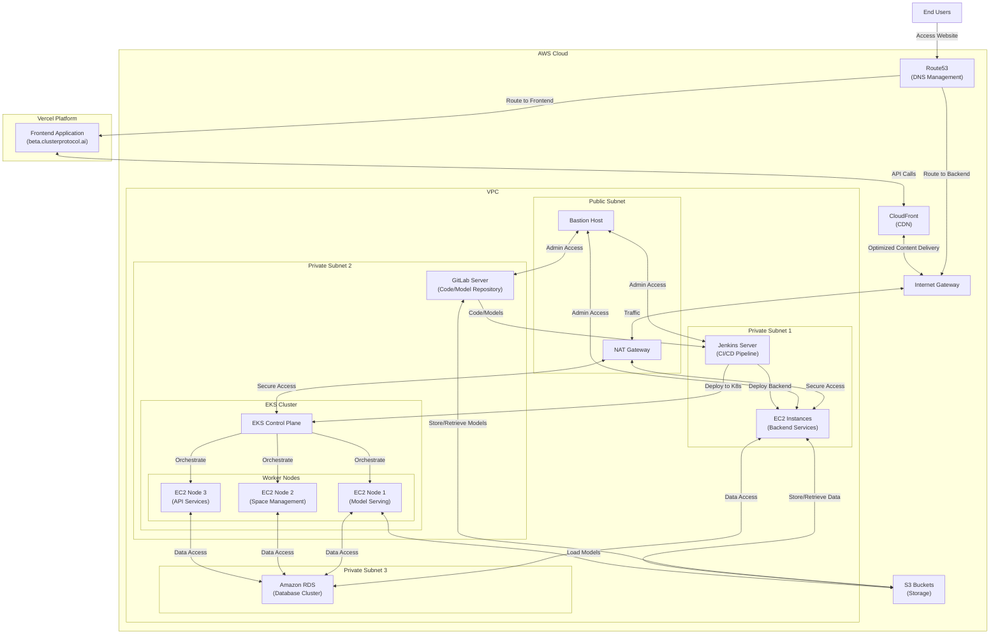

# 🧠 Cluster Protocol Architecture

This architecture represents the deployment setup for the **Cluster Protocol** platform, designed to support a scalable ML-backed application with CI/CD, model management, and robust DevOps practices.

---

## 🗺️ System Overview

---

## 🧩 Component Breakdown

### 🌐 DNS & Routing
- **Route53**: Routes requests to frontend on Vercel or backend services on AWS.
- **Internet Gateway (IGW)**: Enables internet communication for resources inside the VPC.
- **NAT Gateway**: Allows instances in private subnets to securely access the internet.

### 🔐 Security & Access
- **Bastion Host**: Securely SSH into private instances for admin/ops purposes.
- **VPC**: Isolated network environment within AWS, segmented by subnets for better control.

### 🖥️ Compute
- **EC2 (Private Subnet 1)**: Hosts backend services like APIs or processing jobs.
- **EKS Cluster (Private Subnet 2)**:
  - **EKS Control Plane**: Manages Kubernetes workloads.
  - **Worker Nodes**:
    - `Node 1`: Hosts model serving apps.
    - `Node 2`: Manages space, tasks, or sessions.
    - `Node 3`: Runs API gateway/microservices.

### 🔧 DevOps Pipeline
- **GitLab (Private Subnet 2)**: Internal Git server for version control and ML models.
- **Jenkins (Private Subnet 1)**: Automates CI/CD, deploying to EC2 and EKS.

### 🗄️ Storage & Database
- **Amazon S3**: Central storage for user data, models, and artifacts.
- **Amazon RDS**: Relational database backend used by backend services and Kubernetes pods.

### 🌍 Frontend Platform
- **Vercel**: Hosts frontend (`beta.clusterprotocol.ai`) for rapid delivery and global edge performance.
- **CloudFront (CDN)**: Serves static assets and proxies API calls for performance boost and caching.

---

## 🔁 Workflow Summary

1. **User Access**:
   - Users visit the site → DNS (Route53) resolves → Served by Vercel (frontend) or routed to backend.

2. **Frontend–Backend Communication**:
   - Frontend calls backend APIs via CloudFront → Routed to backend EC2 or EKS nodes.

3. **CI/CD Deployment**:
   - Developers push code/models to GitLab → Jenkins picks up → Deploys to EC2/EKS.

4. **Kubernetes Orchestration**:
   - EKS manages containerized services and workloads across Node1–Node3.

5. **Secure Networking**:
   - Bastion host allows limited admin access.
   - NAT gateway provides outbound internet for updates and S3 access from private subnets.

6. **Data & Model Flow**:
   - EC2 and EKS nodes interact with RDS (for structured data) and S3 (for artifacts/models).

---

## 🛠️ Terraform/IaC Suggestions

- **Terraform Modules**:
  - Use [AWS VPC Module](https://registry.terraform.io/modules/terraform-aws-modules/vpc/aws/latest) to manage VPC/subnets.
  - Use [EKS Module](https://registry.terraform.io/modules/terraform-aws-modules/eks/aws/latest) for EKS clusters.
  - Use `terraform-aws-ec2-instance` for bastion host and backend services.
  - Integrate `terraform-aws-s3-bucket`, `terraform-aws-rds`, and `terraform-aws-route53` modules.

- **Separation of Environments**:
  - Maintain separate Terraform workspaces or directories for `dev`, `staging`, and `prod`.

- **Secrets Management**:
  - Integrate **AWS Secrets Manager** or **HashiCorp Vault** to handle database/API keys securely.

- **State Management**:
  - Use **Terraform Cloud** or **S3 + DynamoDB** for remote backend state locking and history.

---

## 💡 Enhancements & Recommendations

- **Observability**:
  - Use Prometheus + Grafana in EKS for monitoring.
  - Integrate AWS CloudWatch Logs for EC2, EKS, and RDS.

- **Security Enhancements**:
  - Enable IAM roles for EC2/EKS with least-privilege policies.
  - Add AWS WAF + Shield for Layer 7 protection on CloudFront.

- **Scalability**:
  - Enable **Auto Scaling Groups** for EC2 backend services.
  - Use **Horizontal Pod Autoscaler (HPA)** in Kubernetes.

- **Cost Optimization**:
  - Leverage **Spot Instances** for non-critical EC2 workloads.
  - Enable **S3 Lifecycle Policies** for logs/artifacts.

---

For questions or contributions, feel free to open issues or submit pull requests.

