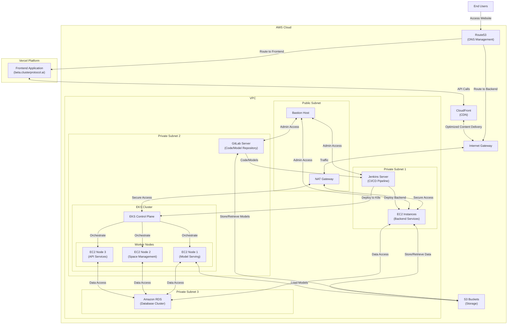

# 🧠 Cluster Protocol Architecture

This architecture represents the deployment setup for the **Cluster Protocol** platform, designed to support a scalable ML-backed application with CI/CD, model management, and robust DevOps practices.

---

## 🗺️ System Overview



---

## 🧩 Component Breakdown

### 🌐 DNS & Routing
- **Route53**: Routes requests to frontend on Vercel or backend services on AWS.
- **Internet Gateway (IGW)**: Enables internet communication for resources inside the VPC.
- **NAT Gateway**: Allows instances in private subnets to securely access the internet.

### 🔐 Security & Access
- **Bastion Host**: Securely SSH into private instances for admin/ops purposes.
- **VPC**: Isolated network environment within AWS, segmented by subnets for better control.

### 🖥️ Compute
- **EC2 (Private Subnet 1)**: Hosts backend services like APIs or processing jobs.
- **EKS Cluster (Private Subnet 2)**:
  - **EKS Control Plane**: Manages Kubernetes workloads.
  - **Worker Nodes**:
    - `Node 1`: Hosts model serving apps.
    - `Node 2`: Manages space, tasks, or sessions.
    - `Node 3`: Runs API gateway/microservices.

### 🔧 DevOps Pipeline
- **GitLab (Private Subnet 2)**: Internal Git server for version control and ML models.
- **Jenkins (Private Subnet 1)**: Automates CI/CD, deploying to EC2 and EKS.

### 🗄️ Storage & Database
- **Amazon S3**: Central storage for user data, models, and artifacts.
- **Amazon RDS**: Relational database backend used by backend services and Kubernetes pods.

### 🌍 Frontend Platform
- **Vercel**: Hosts frontend (`beta.clusterprotocol.ai`) for rapid delivery and global edge performance.
- **CloudFront (CDN)**: Serves static assets and proxies API calls for performance boost and caching.

---

## 🔁 Workflow Summary

1. **User Access**:
   - Users visit the site → DNS (Route53) resolves → Served by Vercel (frontend) or routed to backend.

2. **Frontend–Backend Communication**:
   - Frontend calls backend APIs via CloudFront → Routed to backend EC2 or EKS nodes.

3. **CI/CD Deployment**:
   - Developers push code/models to GitLab → Jenkins picks up → Deploys to EC2/EKS.

4. **Kubernetes Orchestration**:
   - EKS manages containerized services and workloads across Node1–Node3.

5. **Secure Networking**:
   - Bastion host allows limited admin access.
   - NAT gateway provides outbound internet for updates and S3 access from private subnets.

6. **Data & Model Flow**:
   - EC2 and EKS nodes interact with RDS (for structured data) and S3 (for artifacts/models).

---

## 🛠️ Terraform/IaC Suggestions

- **Terraform Modules**:
  - Use [AWS VPC Module](https://registry.terraform.io/modules/terraform-aws-modules/vpc/aws/latest) to manage VPC/subnets.
  - Use [EKS Module](https://registry.terraform.io/modules/terraform-aws-modules/eks/aws/latest) for EKS clusters.
  - Use `terraform-aws-ec2-instance` for bastion host and backend services.
  - Integrate `terraform-aws-s3-bucket`, `terraform-aws-rds`, and `terraform-aws-route53` modules.

- **Separation of Environments**:
  - Maintain separate Terraform workspaces or directories for `dev`, `staging`, and `prod`.

- **Secrets Management**:
  - Integrate **AWS Secrets Manager** or **HashiCorp Vault** to handle database/API keys securely.

- **State Management**:
  - Use **Terraform Cloud** or **S3 + DynamoDB** for remote backend state locking and history.

---

## 💡 Enhancements & Recommendations

- **Observability**:
  - Use Prometheus + Grafana in EKS for monitoring.
  - Integrate AWS CloudWatch Logs for EC2, EKS, and RDS.

- **Security Enhancements**:
  - Enable IAM roles for EC2/EKS with least-privilege policies.
  - Add AWS WAF + Shield for Layer 7 protection on CloudFront.

- **Scalability**:
  - Enable **Auto Scaling Groups** for EC2 backend services.
  - Use **Horizontal Pod Autoscaler (HPA)** in Kubernetes.

- **Cost Optimization**:
  - Leverage **Spot Instances** for non-critical EC2 workloads.
  - Enable **S3 Lifecycle Policies** for logs/artifacts.

---


Detailed analysis and comparison of our current architecture using a **NAT Gateway for EKS access to S3**, versus the **optimized approach of using S3 VPC Gateway Endpoints with IAM roles for direct access**. The goal is to improve **cost-efficiency, performance, security, and maintainability**.

---

## ✅ **Two Approaches**

### 🔁 **Current Implementation: NAT Gateway + Internet Access**

* **How it works:** EKS nodes in private subnets access S3 (and other services) via outbound internet traffic through the NAT Gateway.
* **Security:** Requires outbound internet access.
* **Billing:** You’re charged for:

  * NAT Gateway hourly usage
  * Data transfer through NAT
  * EKS resource costs

---

### 🧭 **Proposed Implementation: S3 VPC Endpoint + IAM Permissions**

* **How it works:** Add a **Gateway VPC Endpoint for S3**, allowing direct, private traffic between EKS nodes and S3 over the AWS backbone.
* **Security:** Traffic never leaves AWS network. No public internet needed.
* **Billing:** You avoid NAT data transfer costs; VPC endpoints are free (for S3 and DynamoDB).

---

## 📊 **Comparison Table**

| Category         | NAT Gateway Approach                            | S3 VPC Endpoint Approach                                  |
| ---------------- | ----------------------------------------------- | --------------------------------------------------------- |
| **Cost**         | ❌ High (NAT hourly + per GB data charges)       | ✅ Free (S3 endpoints are free, data transfer is free)     |
| **Security**     | ❌ Needs internet access for private subnets     | ✅ No internet access; fully private over AWS backbone     |
| **Performance**  | ⚠️ Moderate (relies on internet path)           | ✅ Lower latency, faster access via AWS backbone           |
| **IAM Control**  | ⚠️ Limited unless integrated with bucket policy | ✅ Fine-grained access control via IAM and bucket policies |
| **Scalability**  | ✅ Good, but expensive at scale                  | ✅ Excellent and cost-effective at scale                   |
| **Durability**   | ✅ S3 handles this in both cases                 | ✅ Same (S3 durability is 11 9s regardless of access path) |
| **Compliance**   | ⚠️ Harder to restrict traffic to AWS-only       | ✅ Easy to enforce compliance and logging (VPC logs)       |
| **Auditability** | ⚠️ NAT traffic harder to trace                  | ✅ Fully auditable via VPC Flow Logs and CloudTrail        |

---

## 🔨 **Recommended Implementation Steps for S3 Endpoint Access**

### 1. **Add a Gateway VPC Endpoint for S3**

```bash
# In AWS Console or via Terraform/CDK:
VPC > Endpoints > Create Endpoint
- Service: com.amazonaws.<region>.s3
- Type: Gateway
- VPC: [Your VPC]
- Route Tables: [Associate relevant route tables for private subnets]
```

### 2. **Update S3 Bucket Policies for Access Control**

```json
{
  "Version": "2012-10-17",
  "Statement": [
    {
      "Sid": "AllowVPCOnlyAccess",
      "Effect": "Deny",
      "Principal": "*",
      "Action": "s3:*",
      "Resource": ["arn:aws:s3:::your-bucket/*"],
      "Condition": {
        "StringNotEquals": {
          "aws:SourceVpce": "vpce-xxxxxxxxxxxxxxxxx"
        }
      }
    }
  ]
}
```

### 3. **Attach IAM Roles to EKS Worker Nodes/Pods (IRSA)**

* Use IAM Roles for Service Accounts (IRSA) to restrict specific pod access to buckets.
* Avoid using Node Instance Roles for better granularity.

---

## 📈 **Cost Breakdown Example**

Assume:

* **50GB/day model data** transfer to/from S3
* **30 days/month**

### With NAT Gateway

* NAT usage: \~\$0.045/hr ≈ \$32.40/month
* Data transfer cost: 50 GB/day \* 30 = 1500 GB → \~\$0.045/GB = \$67.50/month
* **Total = \~\$99.90/month**

### With VPC Endpoint

* VPC Gateway Endpoint for S3: **Free**
* Data transfer: **Free**
* **Total = \$0/month** (Only pay for S3 usage/storage)

---

## 🔒 **Security Improvements**

| Area             | NAT Gateway              | VPC Endpoint                            |
| ---------------- | ------------------------ | --------------------------------------- |
| Network Exposure | Public internet involved | Fully private AWS backbone              |
| Access Control   | Limited to CIDRs/IPs     | IAM, bucket policies, endpoint policies |
| Compliance       | Manual effort            | Easier PCI, HIPAA, SOC2 alignment       |

---

## 🧠 **Summary Recommendations**

### ✅ Switch to:

* **S3 Gateway VPC Endpoint**
* **IRSA (IAM Roles for Service Accounts)** for fine-grained access
* **Strict S3 bucket policies** to restrict access to specific VPC Endpoint IDs

### 🚫 Avoid:

* NAT Gateway for large-scale S3 access
* Broad public S3 access or instance-wide IAM roles

---

## 📌 Final Verdict

| Category                    | Winner          |
| --------------------------- | --------------- |
| **Cost**                    | S3 VPC Endpoint |
| **Security**                | S3 VPC Endpoint |
| **Performance**             | S3 VPC Endpoint |
| **Simplicity (once setup)** | S3 VPC Endpoint |
| **Durability**              | Equal (S3)      |

> ✅ **Best Practice**: For model/data-heavy workloads on EKS or EC2, always use **VPC endpoints** + **IAM roles** for direct, secure, scalable S3 access.


